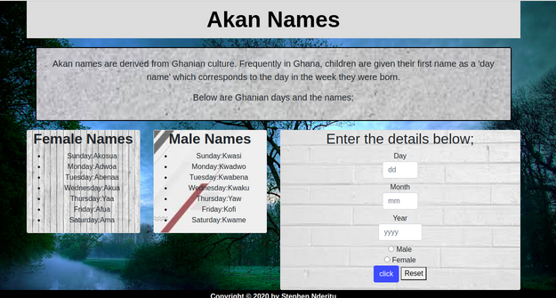

# AKAN WEB APPLICATION
#### By **{Stephen Nderitu}**
## Description
This is a web application that takes a user's birthday and calculates the day of the week they were born and then depending on their gender outputs their Akan Name.
## Project Image

## Setup/Installation Requirements
1. Open the live URL link to the website.
   (https://steve99-coder.github.io/mpft36-0/)
2. Fill the form with the required details.
3. Press the click button.
4. A pop up up message with your Akan name will appear.
## Live Link To The Github Pages
https://steve99-coder.github.io/mpft36-0/
## Behaviour Driven Development (BDD)
1. The Website Displays Form For Entering Day,Month,Year & Gender
       INPUT: "User's Day Filled"
       INPUT: "User's Month Filled"
       INPUT: "User's Year Filled"
       INPUT: "User's Gender Filled"
       OUTPUT: "Displays User's Akan Name"
2. The Website Displays an Error Message if the Day Input Left Blank
       INPUT: ""
       OUTPUT: "Displays Error Message"
3. The Website Displays an Error Message if the Month Input Left Blank
       INPUT: ""
       OUTPUT: "Displays Error Message"   
4. The Website Displays an Error Message if the Year Input Left Blank
       INPUT: ""
       OUTPUT: "Displays Error Message"
5. The Website Displays an Error Message if the Gender Not picked
       INPUT: ""
       OUTPUT: "Display an Error Message"
6. The User Clears Form and Reset the Message on Click
       INPUT: "Click Reset Button"
## Technologies Used
    HTML  
    CSS (Bootstrap)
    JavaScript 
## Contact Information
For any verification please contact me through stevenderitu99@gmail.com
### License
MIT License

Copyright (c) [2020] [StephenNderitu]

Permission is hereby granted, free of charge, to any person obtaining a copy
of this software and associated documentation files (the "Software"), to deal
in the Software without restriction, including without limitation the rights
to use, copy, modify, merge, publish, distribute, sublicense, and/or sell
copies of the Software, and to permit persons to whom the Software is
furnished to do so, subject to the following conditions:

The above copyright notice and this permission notice shall be included in all
copies or substantial portions of the Software.

THE SOFTWARE IS PROVIDED "AS IS", WITHOUT WARRANTY OF ANY KIND, EXPRESS OR
IMPLIED, INCLUDING BUT NOT LIMITED TO THE WARRANTIES OF MERCHANTABILITY,
FITNESS FOR A PARTICULAR PURPOSE AND NONINFRINGEMENT. IN NO EVENT SHALL THE
AUTHORS OR COPYRIGHT HOLDERS BE LIABLE FOR ANY CLAIM, DAMAGES OR OTHER
LIABILITY, WHETHER IN AN ACTION OF CONTRACT, TORT OR OTHERWISE, ARISING FROM,
OUT OF OR IN CONNECTION WITH THE SOFTWARE OR THE USE OR OTHER DEALINGS IN THE
SOFTWARE.
Copyright (c) {2020} **{Stephen Nderitu}**
  